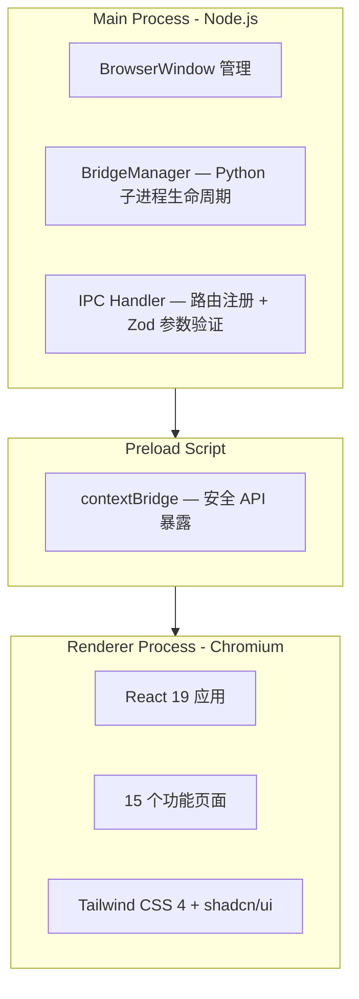
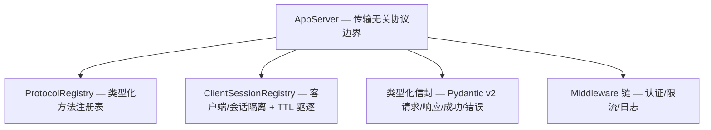
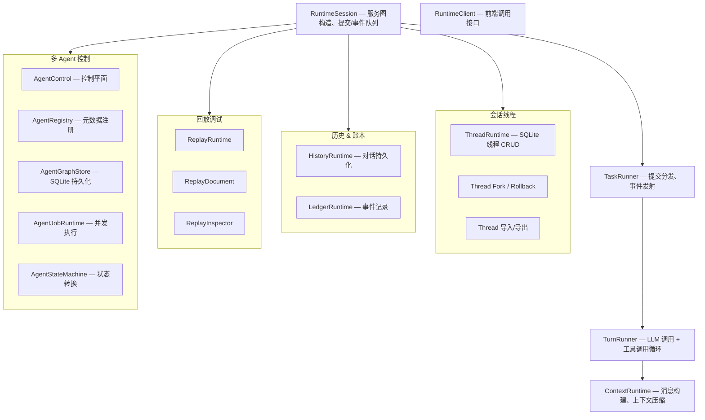
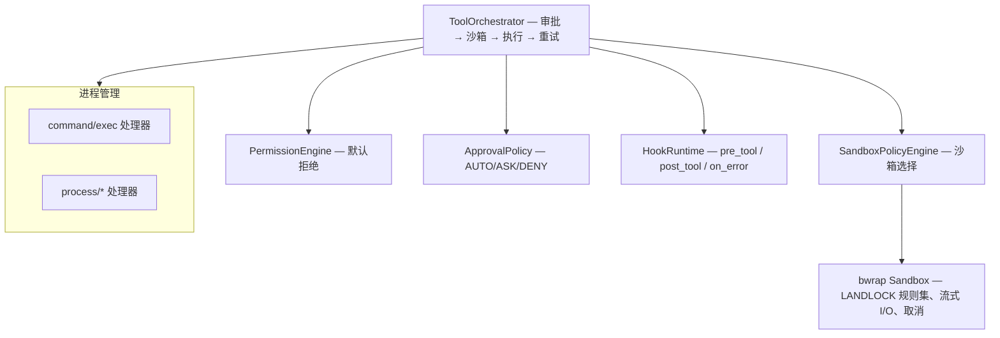
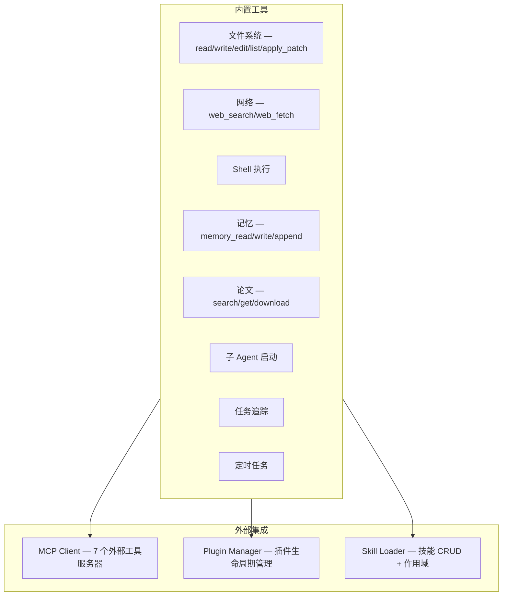

# 系统架构

MiQi 是一个**本地优先的个人 AI 助手框架**，采用五层架构设计，从桌面 UI 到沙箱执行层层隔离。

## 分层架构

### 1. 桌面前端层 (Electron + React)



### 2. Bridge 通信层

前端与后端通过 **stdin/stdout JSON-line 协议** 通信。Bridge Server（`miqi/bridge/server.py`，约 2000 行，57 个 handler）运行在持久化 asyncio 事件循环中（`miqi/bridge/loop.py`），负责协议解析、请求分发和 Agent 执行。

### 3. AppServer 协议层



AppServer（`miqi/runtime/app_server.py`）是 MiQi 自己的传输无关协议层：
- **类型化方法注册**：通过 `ProtocolRegistry`（`miqi/runtime/protocol_registry.py`）管理所有方法规范，含稳定性标记（stable/experimental/deprecated/legacy）和作用域（session/connection/thread 等）
- **客户端/会话隔离**：`ClientSessionRegistry` 按 `(client_id, session_id)` 隔离，空闲会话自动 TTL 驱逐
- **Middleware 链**：请求处理前执行认证、限流、日志等中间件
- **协议目录**：`protocol/catalog` 端点导出 JSON Schema Draft 2020-12 格式的方法目录

### 4. 运行时引擎层 (MiQi Runtime Engine)



### 5. 执行与沙箱层



### 6. 工具与集成层



---

## 核心设计原则

### 1. 前后端分离

前端 (Electron + React) 和后端 (Python) 通过 **JSON-line stdin/stdout** 协议通信，而非 HTTP：

- **零网络依赖**：不需要端口管理，避免端口冲突
- **进程隔离**：Python 进程崩溃不影响 UI
- **安全通信**：不暴露网络接口
- **子进程管理**：Electron 可控制 Python 进程的生命周期

### 2. 类型化应用协议

AppServer 是 MiQi 自己的应用层协议设计：

- **类型化信封**：Pydantic v2 模型定义请求/响应/成功/错误格式
- **ProtocolRegistry**：所有方法按 `MethodStability`/`MethodScope` 分类注册
- **处理器边界验证**：turn 处理器在修改运行时状态前执行类型化参数校验
- **JSON Schema 目录**：`protocol/catalog` 端点按 JSON Schema Draft 2020-12 导出完整方法目录
- **连接握手**：客户端连接时通过 `initialize` 进行能力协商

### 3. 工具编排管道

所有工具执行通过 `ToolOrchestrator` 四阶段管道：

```
审批 (ApprovalPolicy) → 沙箱选择 (SandboxPolicyEngine) → 执行 (ToolRegistry) → 重试 (指数退避)
```

- **PermissionEngine**：默认拒绝策略
- **HookRuntime**：`pre_tool` / `post_tool` / `on_error` 生命周期钩子
- **bwrap 沙箱**：LANDLOCK 文件系统规则，FIFO 驱逐（最多 10 个），流式 I/O

### 4. 多 Agent 架构

- **AgentControl**：多 agent 控制平面，并发 spawn/kill
- **AgentGraphStore**：SQLite 持久化 agent 任务和 spawn 关系
- **AgentStateMachine**：验证状态转换（idle → running → completed/failed/killed）
- **AgentJobRuntime**：并发 agent 任务执行

### 5. 提供商容错

- **ErrorKind 分类**：区分瞬时错误（可重试）和永久错误（不可重试）
- **指数退避重试**：自动重试瞬时错误
- **ProviderFallbackChain**：主 provider 失败时自动切换备选

### 6. 本地优先

- **SQLite 存储**：对话历史、agent 任务图、任务追踪、经验教训
- **JSONL 文件存储**：会话对话记录、记忆快照
- **零外部依赖**：核心功能无需云服务
- **配置文件加密**：API Key 自动 chmod 600 保护

### 7. 可观测性

- **OpenTelemetry SDK 集成**：分布式追踪 + 指标导出
- **TaskTrace**：Git 风格任务追踪（SQLite WAL + FTS5 + fastembed 向量嵌入）

---

## 运行时组件

| 组件 | 进程 | 职责 |
|------|------|------|
| Electron Main | Node.js 主进程 | 窗口管理、IPC 路由、Bridge 生命周期 |
| Electron Renderer | Chromium 渲染进程 | React UI 渲染、用户交互 |
| Bridge Server | Python 子进程 | 协议解析、请求分发、Agent 执行 |
| AppServer | Bridge 内 | 类型化方法注册、参数验证、客户端隔离 |
| RuntimeSession | Bridge 内 | 会话服务图、提交/事件队列 |
| TaskRunner | Bridge 内 | 任务分发、事件发射 |
| TurnRunner | Bridge 内 | LLM 调用 + 工具调用循环 |
| ToolOrchestrator | Bridge 内 | 审批→沙箱→执行管道 |
| MCP Servers | 独立子进程 | 外部工具服务，通过 MCP 协议通信 |
| bwrap Sandbox | 独立进程 | LANDLOCK 隔离的命令执行 |

---

## 协议方法族

MiQi 的 AppServer 协议覆盖以下功能域：

| 族 | 说明 | 方法示例 |
|--------|------|---------|
| `turn/*` | 对话回合管理 | start, interrupt, steer |
| `thread/*` | 会话线程操作 | list, get, rollback, fork, delete, compact/start |
| `fs/*` | 文件系统操作 | readFile, writeFile, createDirectory, readDirectory, remove, copy, watch |
| `fuzzyFileSearch/*` | 文件模糊搜索 | sessionStart, sessionUpdate, sessionStop |
| `command/exec` | 命令执行 | exec, exec/write, exec/resize, exec/terminate |
| `process/*` | 进程管理 | spawn, writeStdin, resizePty, kill, list, get, snapshot |
| `replay.*` | 回放调试 | turns, timeline, messages |
| `config/*` | 配置管理 | get, batchWrite |
| `model/*` | 模型信息 | list, get |
| `feature/*` | 特性开关 | list, set |
| `permission/*` | 权限管理 | listProfiles, getProfile |
| `plugin/*` | 插件管理 | list, install, uninstall, enable, disable, configure |
| `skills/*` | 技能管理 | list, get, create, upload, delete |
| `mcp/*` | MCP 服务状态 | listServers, getServer, status |
| `agent/*` | Agent 控制 | list, get, spawn, kill |
| `protocol/*` | 协议自描述 | catalog, method_names, schema |

### 消息格式

```
Request:       {"jsonrpc": "2.0", "id": "uuid-001", "method": "turn/start", "params": {...}}
Response:      {"jsonrpc": "2.0", "id": "uuid-001", "result": {...}}
Error:         {"jsonrpc": "2.0", "id": "uuid-001", "error": {"code": "INVALID_PARAMS", "message": "..."}}
Event:         {"jsonrpc": "2.0", "method": "turn/progress", "params": {...}}
```

---

## 项目结构

详见 [项目结构](architecture/project-structure.md) 和数据流文档 [数据流](architecture/data-flow.md)。
