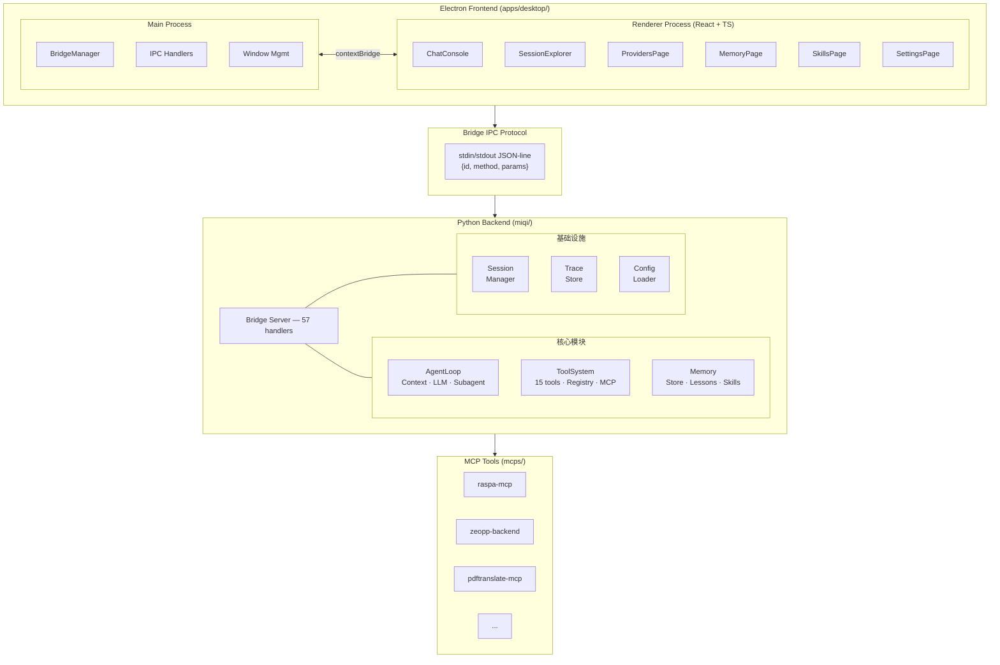

# 系统架构

## 分层架构

MiQi Desktop 采用 **三层分离架构**：

## 核心设计原则

### 1. 前后端分离

前端 (Electron + React) 和后端 (Python Agent) 通过 **JSON-line stdin/stdout** 协议通信，而非 HTTP。这样设计的原因：

- **零网络依赖**：不需要端口管理，避免端口冲突
- **进程隔离**：Python 进程崩溃不影响 UI
- **安全通信**：不暴露网络接口
- **子进程管理**：Electron 可控制 Python 进程的生命周期

### 2. 工具可插拔

所有工具通过 `ToolRegistry` 统一注册，支持：

- 内置工具（文件、网络、Shell 等）
- MCP 外部工具（RASPA2、Zeo++ 等）
- Agent 自定义技能

### 3. 记忆持久化

采用三层记忆架构：Cloud Memory → User Memory → Workspace Memory，确保 Agent 在跨会话、跨项目中保持上下文。

### 4. 非破坏性编辑

文件写入前自动创建快照，支持 diff / revert / accept，提供 Git 之外的轻量级版本控制。

## 运行时组件

| 组件 | 进程 | 职责 |
|------|------|------|
| Electron Main | Node.js 主进程 | 窗口管理、IPC 路由、Bridge 生命周期 |
| Electron Renderer | Chromium 渲染进程 | React UI 渲染、用户交互 |
| Bridge Server | Python 子进程 | 协议解析、请求分发、Agent 执行 |
| MCP Servers | 独立子进程 | 外部工具服务，通过 MCP 协议通信 |
