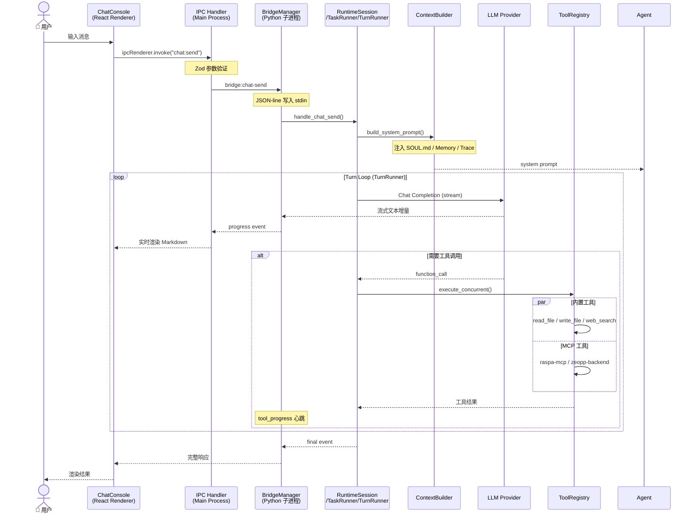

# 数据流

## 用户消息 → AI 响应的完整链路



## 事件类型

Bridge 协议支持三种事件流：

| 事件类型 | 方向 | 说明 |
|----------|------|------|
| `progress` | Backend → Frontend | LLM 流式输出增量文本 |
| `tool_progress` | Backend → Frontend | 工具调用进度（MCP 心跳） |
| `error` | Backend → Frontend | 异常错误信息 |

## 请求/响应模型

```
Request:  前端发起
  {"id": "uuid-001", "method": "chat:send", "params": {...}}

Response: 后端同步响应
  {"id": "uuid-001", "result": {...}}

Event: 后端流式推送
  {"id": "uuid-001", "type": "progress", "data": {"text": "..."}}
```

`id` 字段用于关联请求与对应的流式事件，前端通过 `id` 将事件路由到正确的对话窗口。

## 并发处理

- **多会话并行**：每个会话维护独立的 `RuntimeSession` 实例，互不阻塞
- **工具并行**：`ToolRegistry` 支持批量工具的并发执行
- **MCP 心跳**：长时运行的工具通过心跳机制报告进度
