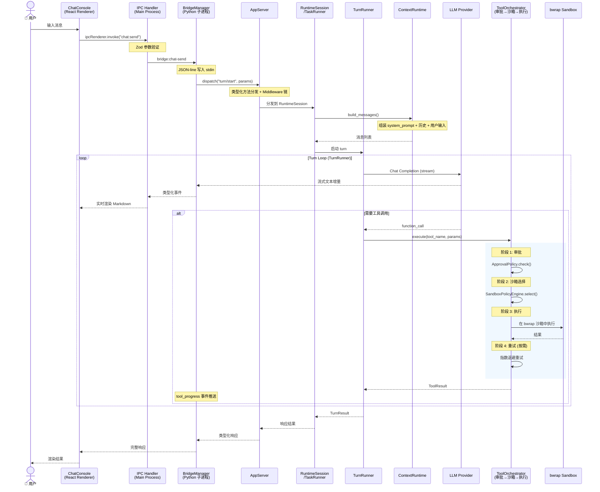

# 数据流

## 用户消息 → AI 响应的完整链路



## 协议层

### 消息格式

MiQi 使用 **JSON-line 协议** 通过 stdin/stdout 通信，每条消息为一行完整 JSON：

```
Request (前端 → 后端):
  {"jsonrpc": "2.0", "id": "uuid-001", "method": "turn/start", "params": {...}}

Success Response (后端 → 前端):
  {"jsonrpc": "2.0", "id": "uuid-001", "result": {...}}

Error Response (后端 → 前端):
  {"jsonrpc": "2.0", "id": "uuid-001", "error": {"code": "INVALID_PARAMS", "message": "..."}}

Event (后端 → 前端, 流式推送):
  {"jsonrpc": "2.0", "method": "turn/progress", "params": {...}}
```

### 事件类型

AppServer 通过 `miqi/protocol/events.py` 定义多种事件类型：

| 事件 | 方向 | 说明 |
|------|------|------|
| `TurnStartedEvent` | Backend → Frontend | Turn 开始执行 |
| `AgentMessageDeltaEvent` | Backend → Frontend | LLM 流式文本增量 |
| `ToolCallBeginEvent` | Backend → Frontend | 工具调用开始 |
| `ToolCallEndEvent` | Backend → Frontend | 工具调用完成 |
| `ApprovalRequestedEvent` | Backend → Frontend | 命令审批请求 |
| `SubAgentSpawnedEvent` | Backend → Frontend | 子 Agent 启动 |
| `PlanUpdateEvent` | Backend → Frontend | 计划更新通知 |
| `ErrorEvent` | Backend → Frontend | 异常错误 |
| `TurnCompletedEvent` | Backend → Frontend | Turn 完成 |
| `TurnInterruptedEvent` | Backend → Frontend | Turn 被中断 |
| `FsChangedEvent` | Backend → Frontend | 文件系统变更通知 |
| `FuzzyFileSearchUpdatedEvent` | Backend → Frontend | 模糊搜索更新 |
| ... | | 等 |

## 连接握手

客户端（Electron）启动 Python 子进程后，通过 `initialize` 进行能力协商：

```
Client → Server:  {"method": "initialize", "params": {"clientInfo": {...}, "capabilities": {...}}}
Server → Client:  {"method": "initialized", "params": {"serverInfo": {...}, "capabilities": {...}}}
```

## 并发处理

- **多会话并行**：`ClientSessionRegistry` 按 `(client_id, session_id)` 隔离，TTL 驱逐
- **工具并行**：`ToolOrchestrator` 支持批量工具并发执行
- **多 Agent 并发**：`AgentControl` + `AgentJobRuntime` 管理并发 agent 任务
- **请求序列化**：同一会话内请求通过 `RuntimeSession` 锁序列化
