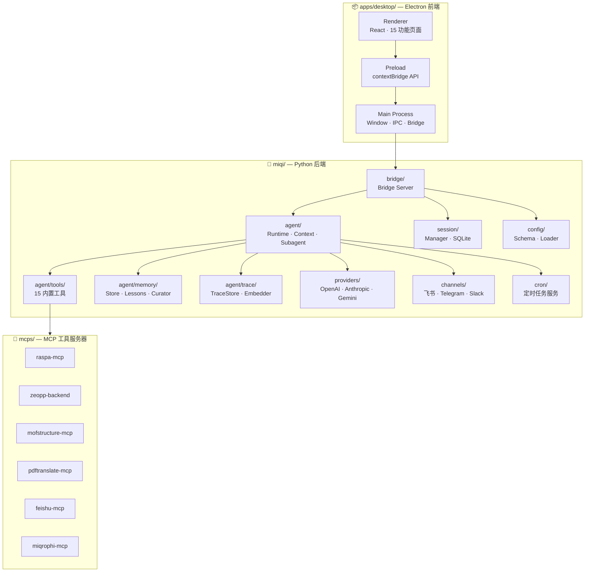

# 项目结构

## 模块依赖关系



## 目录结构

```
miqi-desktop/
├── miqi/                        Python 后端
│   ├── agent/                   核心代理引擎
│   │   ├── turn_runner.py        TurnRunner — LLM调用循环 (runtime/)
│   │   ├── context.py           ContextBuilder — 系统提示词构建
│   │   ├── subagent.py          SubagentManager — 子代理管理
│   │   ├── tools/               工具系统 (15个工具)
│   │   │   ├── web.py           WebSearch / WebFetch
│   │   │   ├── filesystem.py    ReadFile / WriteFile / EditFile / ListDir
│   │   │   ├── shell.py         Shell 命令执行
│   │   │   ├── memory.py        长期记忆读写追加
│   │   │   ├── skill_manage.py  技能 CRUD
│   │   │   ├── session_search.py FTS5 跨会话搜索
│   │   │   ├── cron.py          定时任务创建
│   │   │   ├── papers.py        论文搜索/获取/下载
│   │   │   ├── spawn.py         子代理启动
│   │   │   └── task_trace.py    Git 风格任务追踪 (begin/end/search)
│   │   ├── memory/              记忆与自改进系统
│   │   │   ├── store.py         MemoryStore + LessonStore
│   │   │   ├── lessons.py       经验教训状态机
│   │   │   └── skill_curator.py LLM 驱动的技能生命周期管理
│   │   └── trace/               任务追踪 (Git 风格)
│   │       ├── store.py         TraceStore (SQLite WAL + FTS5)
│   │       ├── model.py         TaskTrace / TaskStep 数据模型
│   │       ├── embedder.py      fastembed 向量嵌入与相似度搜索
│   │       └── migrate.py       LESSONS.jsonl → TaskTrace 迁移
│   ├── bridge/                  与 Electron 的桥接通信
│   │   └── server.py            Bridge Server (~2000行, 57 handler)
│   ├── providers/               LLM 提供商适配
│   │   ├── registry.py          ProviderSpec 注册表
│   │   ├── openai_provider.py   OpenAI 兼容适配
│   │   ├── anthropic_provider.py Anthropic Claude 适配
│   │   └── gemini_provider.py   Google Gemini 适配
│   ├── config/                  配置管理
│   │   ├── schema.py            Pydantic 配置模型
│   │   └── loader.py            配置文件加载与保存
│   ├── session/                 会话管理
│   │   ├── manager.py           SessionManager
│   │   └── sqlite_store.py      SQLite 存储后端
│   ├── channels/                消息通道 (飞书/Telegram/Slack/邮件/...)
│   ├── cron/                    定时任务服务
│   ├── cli/                     CLI 命令入口
│   ├── bus/                     内部消息总线
│   ├── heartbeat/               心跳服务
│   ├── skills/                  内置技能模板
│   └── utils/                   工具函数
│
├── apps/desktop/                Electron 前端
│   ├── src/
│   │   ├── main/                主进程
│   │   │   ├── index.ts         BrowserWindow + IPC 注册
│   │   │   ├── bridge.ts        BridgeManager (Python 子进程管理)
│   │   │   └── ipc/             IPC Handler 实现 + Zod 验证
│   │   ├── preload/
│   │   │   └── index.ts         contextBridge 安全 API 暴露
│   │   ├── renderer/            渲染进程 (React)
│   │   │   ├── App.tsx          路由导航核心
│   │   │   ├── components/      共享组件 (Sidebar, ContextMenu)
│   │   │   ├── contexts/        React Context (RuntimeContext)
│   │   │   └── features/        15个功能页面
│   │   │       ├── chat/        聊天界面 (ChatConsole)
│   │   │       ├── sessions/    会话管理 (SessionExplorer)
│   │   │       ├── providers/   LLM 提供商管理
│   │   │       ├── memory/      记忆系统
│   │   │       ├── skills/      技能管理 + SkillHub
│   │   │       ├── settings/    设置页面
│   │   │       ├── setup/       设置向导 (含 WSL2)
│   │   │       ├── mcps/        MCP 管理
│   │   │       ├── workspace/   工作区管理
│   │   │       ├── cron/        定时任务
│   │   │       ├── channels/    消息通道
│   │   │       ├── approvals/   命令审批
│   │   │       └── experience/  经验面板
│   │   └── shared/              共享类型 + IPC 常量
│   ├── electron-builder.yml     打包配置
│   ├── electron.vite.config.ts  Vite 构建配置
│   └── package.json
│
├── mcps/                        MCP 子模块 (git submodules)
│   ├── raspa-mcp                RASPA2 分子模拟
│   ├── zeopp-backend            Zeo++ 孔隙分析
│   ├── mofstructure-mcp         MOF 结构分析
│   ├── mofchecker-mcp           MOF 结构检查
│   ├── pdftranslate-mcp         PDF 论文翻译
│   ├── feishu-mcp               飞书集成
│   └── miqrophi-mcp             Miqrophi 科学计算
│
├── tests/                       Python 测试 (27 个文件)
├── scripts/                     运维脚本
├── build/                       PyInstaller 构建输出
├── dist/                        Python 分发包
├── dist-new/                    electron-builder 输出
├── docs/                        项目文档 (MkDocs Material)
│
├── pyproject.toml                Python 项目配置
├── miqi.spec                    PyInstaller 打包规范
├── Dockerfile                   Docker 镜像定义
├── docker-compose.yml           Docker Compose 编排
├── uv.lock                      Python 依赖锁定
├── mkdocs.yml                   文档站点配置
├── README.md / README_zh.md     项目说明
├── ROADMAP.md                   工程路线图
├── CHANGELOG.md                 变更日志
├── CONTRIBUTING.md              贡献指南
└── LICENSE                      MIT 许可证
```
