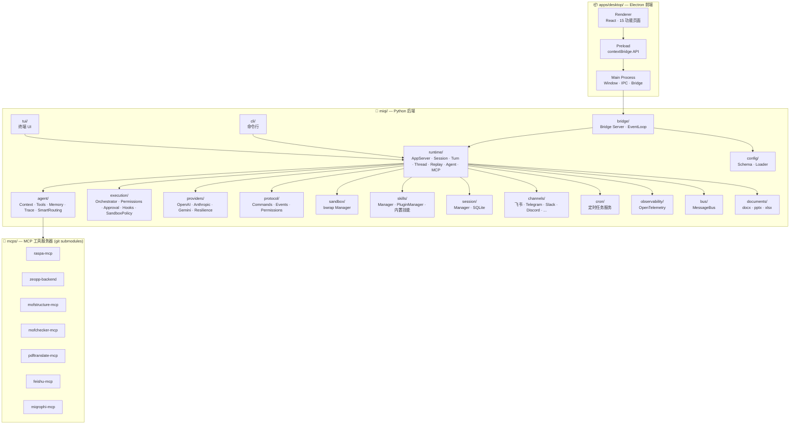

# 项目结构

## 模块依赖关系



## 目录结构

```
miqi-desktop/
├── miqi/                        Python 后端
│   ├── runtime/                 运行时引擎 (87+ 文件)
│   │   ├── session.py           RuntimeSession — 服务图构造
│   │   ├── client.py            RuntimeClient — 前端调用接口
│   │   ├── services.py          RuntimeServices — 服务图工厂
│   │   ├── task_runner.py       TaskRunner — 提交分发器
│   │   ├── turn_runner.py       TurnRunner — LLM + 工具循环
│   │   ├── app_server.py        AppServer — 传输无关协议边界
│   │   ├── app_protocol.py      类型化信封 (Pydantic v2)
│   │   ├── protocol_registry.py ProtocolRegistry — 方法注册表
│   │   ├── protocol_specs.py    类型化方法规范定义
│   │   ├── turn_request_models.py Turn 请求类型化验证
│   │   ├── context_runtime.py   ContextRuntime — 消息构建/上下文压缩
│   │   ├── tool_runtime.py      ToolRuntime — 工具执行包装
│   │   ├── thread_runtime.py    ThreadRuntime — SQLite 线程 CRUD
│   │   ├── history_runtime.py   HistoryRuntime — 对话持久化
│   │   ├── ledger_runtime.py    LedgerRuntime — 事件记录
│   │   ├── replay_runtime.py    ReplayRuntime — 确定性回放
│   │   ├── agent_control.py     AgentControl — 多 agent 控制平面
│   │   ├── agent_registry.py    AgentRegistry — agent 元数据
│   │   ├── agent_graph_store.py AgentGraphStore — SQLite agent 图
│   │   ├── agent_jobs.py        AgentJobRuntime — 并发执行
│   │   ├── mcp_runtime.py       McpRuntime — MCP 适配器
│   │   ├── plugin_catalog.py    PluginCatalogRuntime — 插件管理
│   │   ├── capabilities.py      CapabilityResolver — 能力解析
│   │   ├── feature_runtime.py   特性开关
│   │   ├── fs_watch_runtime.py  文件监听
│   │   ├── fuzzy_file_search_runtime.py 模糊文件搜索
│   │   ├── workbench_process_runtime.py 进程管理
│   │   ├── turn_event_adapter.py Turn 事件适配
│   │   ├── initialize_protocol.py 连接握手
│   │   └── *_handlers.py        各类 AppServer 处理器
│   ├── agent/                   Agent 引擎
│   │   ├── context.py           ContextBuilder — 系统提示词组装
│   │   ├── context_engine.py    ContextEngine ABC — 可插拔压缩
│   │   ├── context_compressor.py ContextCompressor — 5 阶段压缩
│   │   ├── smart_routing.py     SmartRouting — 廉价模型路由
│   │   ├── command_approval.py  危险命令审批 (39 模式)
│   │   ├── iteration_budget.py  IterationBudget — 线程安全计数器
│   │   ├── subagent.py          SubagentManager (legacy)
│   │   ├── tools/               工具系统 (16 个工具)
│   │   │   ├── base.py          Tool / ToolRegistry
│   │   │   ├── filesystem.py    ReadFile / WriteFile / EditFile / ListDir
│   │   │   ├── apply_patch.py   ApplyPatch — Unified Diff
│   │   │   ├── shell.py         Shell 命令执行
│   │   │   ├── web.py           WebSearch / WebFetch
│   │   │   ├── memory.py        长期记忆读写追加
│   │   │   ├── message.py       消息工具
│   │   │   ├── skill_manage.py  技能 CRUD
│   │   │   ├── session_search.py FTS5 跨会话搜索
│   │   │   ├── cron.py          定时任务
│   │   │   ├── papers.py        论文搜索/获取/下载
│   │   │   ├── spawn.py         子 Agent 启动
│   │   │   ├── task_trace.py    Git 风格任务追踪
│   │   │   └── mcp.py           MCP 工具代理
│   │   ├── memory/              记忆系统
│   │   │   ├── store.py         MemoryStore
│   │   │   ├── snapshot.py      记忆快照
│   │   │   ├── lessons.py       经验教训
│   │   │   ├── curator.py       记忆整理
│   │   │   ├── skill_curator.py 技能生命周期
│   │   │   ├── experience_store.py 经验存储
│   │   │   ├── provider.py      记忆提供者
│   │   │   └── nlp.py           NLP 工具
│   │   └── trace/               任务追踪 (Git 风格)
│   │       ├── store.py         TraceStore (SQLite WAL + FTS5)
│   │       ├── model.py         TaskTrace / TaskStep
│   │       ├── embedder.py      fastembed 向量嵌入
│   │       └── migrate.py       LESSONS.jsonl → TaskTrace 迁移
│   ├── bridge/                  与 Electron 的桥接层
│   │   ├── server.py            Bridge Server (~2000 行, 57 handler)
│   │   ├── loop.py              BridgeRuntimeLoop (持久化事件循环)
│   │   └── event_emitter.py     EventEmitter
│   ├── bus/                     内部消息总线
│   │   ├── events.py            InboundMessage / OutboundMessage
│   │   └── queue.py             MessageBus (异步队列 + 溢出处理)
│   ├── execution/               工具执行引擎
│   │   ├── orchestrator.py      ToolOrchestrator (审批→沙箱→执行→重试)
│   │   ├── factory.py           默认编排器工厂
│   │   ├── permission_engine.py PermissionEngine (默认拒绝)
│   │   ├── approval_policy.py   ApprovalPolicy / ApprovalMode
│   │   ├── exec_policy.py       ExecPolicy / PolicyVerdict
│   │   ├── sandbox_policy.py    SandboxPolicyEngine / SandboxSelection
│   │   └── hook_runtime.py      HookRuntime / HookPoint / HookOutcome
│   ├── protocol/                运行时通信协议定义
│   │   ├── commands.py          提交类型 (UserMessage, ApprovalResponse, ...)
│   │   ├── events.py            事件类型定义
│   │   └── permissions.py       沙箱权限类型
│   ├── providers/               LLM 提供商
│   │   ├── base.py              LLMProvider (ABC)
│   │   ├── factory.py           make_provider
│   │   ├── registry.py          ProviderSpec 注册表
│   │   ├── openai_provider.py   OpenAI 适配
│   │   ├── anthropic_provider.py Anthropic Claude 适配
│   │   ├── gemini_provider.py   Google Gemini 适配
│   │   ├── custom_provider.py   OpenAI 兼容自定义 provider
│   │   ├── fallback.py          ProviderFallbackChain
│   │   ├── resilience.py        ErrorKind 分类 + 重试
│   │   └── transcription.py     Groq 转录
│   ├── sandbox/                 bwrap 沙箱
│   │   ├── bwrap.py             BwrapSandbox (LANDLOCK, FIFO 驱逐)
│   │   └── manager.py           SandboxManager (per-session 生命周期)
│   ├── skills/                  技能系统
│   │   ├── skill_manager.py     SkillManager / SkillMetadata / SkillScope
│   │   ├── plugin_manager.py    PluginManager / PluginManifest
│   │   └── */                   内置技能 (cron, feishu-report, github, memory, ...)
│   ├── session/                 会话管理
│   │   ├── manager.py           SessionManager
│   │   └── sqlite_store.py      SQLite 存储后端
│   ├── config/                  配置管理
│   │   ├── schema.py            Pydantic 配置模型
│   │   └── loader.py            配置文件加载与保存 (~/.miqi/config.json)
│   ├── channels/                消息通道 (飞书/Telegram/Slack/Discord/钉钉/QQ/邮件/...)
│   ├── cron/                    定时任务服务
│   ├── context/                 上下文 (fragments, thread_store)
│   ├── heartbeat/               心跳服务 (30 分钟轮询 HEARTBEAT.md)
│   ├── plan/                    计划追踪器
│   ├── documents/               Office 文档 (docx/pptx/xlsx)
│   ├── observability/           OpenTelemetry 集成
│   ├── cli/                     CLI 命令接口
│   ├── tui/                     终端 UI (Textual)
│   ├── server/                  服务器资产
│   ├── templates/               模板 (SOUL.md, USER.md, AGENTS.md, HEARTBEAT.md, MEMORY.md)
│   └── utils/                   工具函数
│
├── apps/desktop/                Electron 前端
│   ├── src/
│   │   ├── main/                主进程
│   │   │   ├── index.ts         BrowserWindow + IPC 注册
│   │   │   ├── bridge.ts        BridgeManager (Python 子进程管理)
│   │   │   └── ipc/             IPC Handler 实现 + Zod 验证
│   │   ├── preload/
│   │   │   └── index.ts         contextBridge 安全 API 暴露
│   │   ├── renderer/            渲染进程 (React)
│   │   │   ├── App.tsx          路由导航核心
│   │   │   ├── components/      共享组件 (Sidebar, ContextMenu)
│   │   │   ├── contexts/        React Context (RuntimeContext)
│   │   │   └── features/        15 个功能页面
│   │   │       ├── chat/        聊天界面 (ChatConsole)
│   │   │       ├── sessions/    会话管理 (SessionExplorer)
│   │   │       ├── providers/   LLM 提供商管理
│   │   │       ├── memory/      记忆系统
│   │   │       ├── skills/      技能管理 + SkillHub
│   │   │       ├── settings/    设置页面
│   │   │       ├── setup/       设置向导
│   │   │       ├── mcps/        MCP 管理
│   │   │       ├── workspace/   工作区管理
│   │   │       ├── cron/        定时任务
│   │   │       ├── channels/    消息通道
│   │   │       ├── approvals/   命令审批
│   │   │       └── experience/  经验面板
│   │   └── shared/              共享类型 + IPC 常量
│   ├── electron-builder.yml     打包配置
│   ├── electron.vite.config.ts  Vite 构建配置
│   └── package.json
│
├── mcps/                        MCP 子模块 (git submodules)
│   ├── raspa-mcp                RASPA2 分子模拟
│   ├── zeopp-backend            Zeo++ 孔隙分析
│   ├── mofstructure-mcp         MOF 结构分析
│   ├── mofchecker-mcp           MOF 结构检查
│   ├── pdftranslate-mcp         PDF 论文翻译
│   ├── feishu-mcp               飞书集成
│   └── miqrophi-mcp             Miqrophi 科学计算
│
├── tests/                       Python 测试 (~150+ 文件)
│   ├── runtime/                 运行时测试 (~70+ 文件)
│   ├── bridge/                  桥接协议和审计测试 (~20+ 文件)
│   ├── execution/               执行引擎测试
│   ├── providers/               LLM 提供商测试
│   ├── protocol/                协议测试
│   ├── agent/tools/             工具级测试
│   └── ...                      其他测试
├── docs/                        项目文档 (MkDocs)
├── plan/                        实现计划 (不纳入 VCS)
├── scripts/                     构建和工具脚本
│
├── pyproject.toml                Python 项目配置
├── miqi.spec                    PyInstaller 打包规范
├── uv.lock                      Python 依赖锁定
├── mkdocs.yml                   文档站点配置
├── README.md / README_zh.md     项目说明
├── CHANGELOG.md                 变更日志
├── CONTRIBUTING.md              贡献指南
└── LICENSE                      MIT 许可证
```
