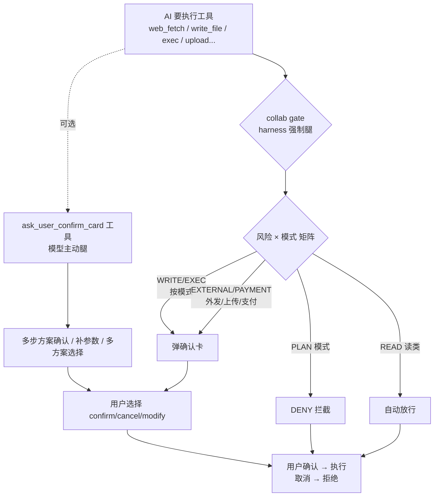

# #646 执行前确认——方案设计与实现文档

> 状态：设计定稿（ChatGPT 架构评审 10 条拍板）+ 实现完成（PR #684，draft）
> 关联：#711（owner 的 #646 重做，已合并）——#684 基于其 rebase，补全桌面主路径
> 本文说明：**要解决什么、方案是什么、我们做了什么实现、怎么验证**

---

## 1. 要解决的问题

AI 执行关键操作（访问外部网页、写文件、执行命令、上传文件、支付）时**不经过用户同意**。
原状：模型"说做就做"，最多在文本里问一句"我可以访问吗？"——用户不看/没空回，AI 就继续了。

Issue 原文核心要求：
> 关键步骤执行前增加卡片弹窗确认——**不能依赖模型在文本里询问**，必须有可被 harness
> 强制拦截的结构化机制（工具接口 + 固定场景的前端/规则确认互补）。

即两条硬要求：
1. **结构化**：确认是一个工具接口/弹窗，不是文本
2. **强制**：即使模型忘了问，harness 也要拦下来问

---

## 2. 方案设计（v2 定稿）

### 2.1 两条腿：模型主动 + harness 强制



### 2.2 两层语义（不合并引擎，合并 UI）

```
Tool Call
   │
   ▼
Permission Engine（Safety：能不能执行）
   │  需要时弹「操作审批」（允许一次/会话/永久）
   │  → approval_resolved 标记（已审批的调用 gate 不再重复弹）
   ▼
Collab Gate（Collaboration：用户是否同意这个动作）
   │  collab_policy.evaluate(tool_name, autonomy_mode)
   │  ├─ DENY    → denied_by_policy（plan 模式）
   │  ├─ CONFIRM → 弹确认卡（无 UI 通道降级放行）
   │  └─ ALLOW   → 直接执行
   ▼
Sandbox → Execute
```

- **审批**（Safety）："这个工具在当前安全策略下允许吗？"——工具级、可 bypass、可 remember
- **确认卡**（Collaboration）："AI 现在要做的这件事，你同意吗？"——动作级、**永远 one-shot**（"同意上传 A"≠"以后全自动上传"）、不可 bypass

### 2.3 风险矩阵（collab_policy.py）

| 风险类 | 例子 | 默认 |
|---|---|---|
| READ_LOCAL | 读文件、列目录 | 自动 |
| READ_EXTERNAL | web_search、web_fetch | 自动（外部读取≠外部副作用；敏感数据归 Safety 层） |
| WRITE_LOCAL | 写文件 | 按模式（manual/supervised 确认） |
| EXEC | shell/script | 按模式（默认确认，审批通过则 gate 跳过） |
| EXTERNAL_MUTATION | 上传、外发 | **永远确认** |
| PAYMENT | 支付、购买 | **永远确认** |
| DESTRUCTIVE | 删除、覆盖、大规模变更 | **永远确认** |

### 2.4 模式映射（桌面模式选择器 → gate）

| 桌面模式 | execution_policy | autonomy_mode | 行为 |
|---|---|---|---|
| 规划 | plan | plan | 只分析不动手（WRITE/EXEC/EXTERNAL 全 DENY） |
| 手动 | ask/manual | manual | 每步确认 |
| 允许编辑 | edit | supervised | 写自动、风险确认 |
| 自动 | auto | autonomous | 低风险自动、高风险确认 |

（P0-1 修复：模式经 `autonomy_mode_from_policy()` 从 turn.execution_policy 真实透传——此前是死代码，永远 supervised）

---

## 3. 实现内容（PR #684——我们做的）

### 3.1 后端（legacy 桌面主路径）

| 模块 | 实现 |
|---|---|
| `orchestrator.py` | collab gate 插桩（approval 之后、sandbox 之前）：DENY 拦截 / CONFIRM 弹卡 / 无通道降级 / `approval_resolved` 防双弹 / 中文卡文案（URL/路径/命令提取） |
| `collab_policy.py` | 风险矩阵 + `autonomy_mode_from_policy()` 模式映射 |
| `task_runner.py` | `ASK_USER_CONFIRM_INSTRUCTION` 注入（legacy 提示词——模型知道有确认卡） |
| `ask_user_confirm.py` | 契约扩展：`warnings`（B 级校验警告必上卡）+ `metadata`（run_id/artifact_sha256 确认绑定防 TOCTOU）；指令分层（方案卡归模型、执行卡归 gate——防双卡） |
| `user_input_resolver.py` | session_key 隔离 emitter（P1-4 并发安全）+ remember 命中不弹卡 |
| `bridge/loop.py` | chat.send 设置/清理按会话 emitter |
| `user_input_gate.py` | remember 读取补全（#711 只有写入） |

### 3.2 前端（ConfirmCard UI——Kimi k2.6 三轮视觉评审迭代）

```
┌──────────────────────────────────────┐
│ 🌐 确认访问外部网页？        [等待你的选择·⏱1:47 后自动取消] │
│                                      │
│ AI 想访问外部网页：                    │
│   example.com/docs/spec（域名高亮+↗）  │
│                                      │
│ ⚠ 2 个校验警告（左色条）               │
│ 📎 run.json · 17.9 KB · sha256:abc1… │
│                                      │
│            [取消]  [确认执行]          │
└──────────────────────────────────────┘
```

- 等待态：emoji 图标 + 中文标题 + URL 域名高亮 + 徽章倒计时「后自动取消」
- 确认后：完成式标题「已确认访问外部网页」+ 执行中步骤保持展开（进度条 + ✓/⟳/○）
- 历史卡：compact 折叠（点「展开详情」恢复）
- 超时：独立「已超时」语义（不与取消混淆）
- 下载成功 toast：屏幕居中 + 淡入淡出 + 2s
- 测试：15 个（警告区/元数据/折叠/live 展开/倒计时）

### 3.3 与 #711 的分工

```
#711（owner，已合并）：KUN 路径完整实现
  ├─ ask_user_confirm_card 工具 + KUN gate 接线
  ├─ 4 个链路 bug 修复 + E2E 测试
  └─ ❌ 桌面主路径（legacy）gate 零接线

#684（我们，draft）：补全桌面主路径
  ├─ ✅ legacy collab gate（orchestrator 插桩）
  ├─ ✅ 契约扩展（warnings/metadata）
  ├─ ✅ legacy 提示词注入
  ├─ ✅ Kimi 迭代 UI / 并发隔离 / 双弹处理
  └─ 基于 #711 rebase（449331ff）
```

---

## 4. 验证

| 套件 | 结果 |
|---|---|
| pytest execution + kun_runtime | **750 passed** |
| gate 专项（真实路径/审批跳过/并发隔离/DENY） | 14 passed |
| 确认卡契约（warnings/metadata/remember） | 27 passed |
| vitest（ConfirmCard 15） | 179 passed |
| tsc web+node | 0 错误 |
| 真机 E2E | ⏳ 待跑（#711 的 confirm-card.spec.ts） |

测试覆盖的关键场景：
- plan 模式 DENY（真实路径经 ToolRuntime 构造）
- auto 模式直执行（mock 工具成功 = 显式断言）
- 审批通过后 gate 跳过（exec 双弹消除）
- 双会话 emitter 隔离（并发不串流）
- remember 命中不弹卡（emissions==1）

---

## 5. 设计决策记录

1. **两条腿**：模型主动（ask_user_confirm_card）+ harness 强制（collab gate）——gate 是主路径
2. **两层语义**：Safety 审批 vs Collaboration 确认——不合并引擎、合并 UI（一个弹窗）
3. **collab 永远 one-shot**：不做 remember（Safety 才允许 remember）
4. **确认绑定产物**：metadata（run_id + artifact_sha256）防"确认 A 上传 B"
5. **web_fetch 移出 EXTERNAL**：已被前端操作审批覆盖（2026-08-14 实测双弹反馈）
6. **审批通过 → gate 跳过**：exec/上传类双弹消除（#684-1）
7. **模式矩阵真实接入**：autonomy_mode_from_policy（P0-1）
8. **UI 迭代**：Kimi k2.6 三轮评审（标题/倒计时/警告区/完成式/折叠/toast）
