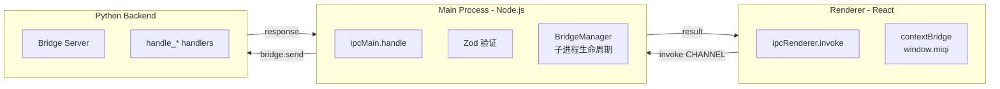

# IPC 通信

IPC（进程间通信）是 Electron 前端与 Python 后端的通信桥梁。

## 三层通信架构



## IPC 通道定义

所有通道在 `apps/desktop/src/shared/ipc.ts` 中统一定义，包含 Zod Schema 验证：

```typescript
// IPC 通道常量
export const IPC = {
  // Chat
  CHAT_SEND:    "chat:send",
  CHAT_ABORT:   "chat:abort",

  // Sessions
  SESSIONS_LIST:        "sessions:list",
  SESSIONS_GET:         "sessions:get",
  SESSIONS_DELETE:      "sessions:delete",
  SESSIONS_ARCHIVE:     "sessions:archive",
  SESSIONS_UNARCHIVE:   "sessions:unarchive",
  SESSIONS_GET_TRACKED_FILES: "sessions:get_tracked_files",

  // Config
  CONFIG_GET:    "config:get",
  CONFIG_SET:    "config:set",

  // Providers
  PROVIDERS_LIST: "providers:list",
  PROVIDERS_TEST: "providers:test",
  PROVIDERS_UPDATE: "providers:update",

  // Memory
  MEMORY_FACTS:    "memory:facts",
  MEMORY_LESSONS:  "memory:lessons",
  MEMORY_DELETE_LESSON: "memory:delete_lesson",
  MEMORY_TOGGLE_LESSON: "memory:toggle_lesson",

  // Skills
  SKILLS_LIST:   "skills:list",
  SKILLS_CREATE: "skills:create",
  SKILLS_UPLOAD: "skills:upload",
  SKILLS_DELETE: "skills:delete",

  // Files
  FILES_DIFF:    "files:diff",
  FILES_REVERT:  "files:revert",
  FILES_ACCEPT:  "files:accept",

  // MCPs
  MCPS_LIST:   "mcps:list",
  MCPS_UPSERT: "mcps:upsert",
  MCPS_DELETE: "mcps:delete",

  // WSL
  WSL_CHECK:  "wsl:check",
  WSL_INSTALL: "wsl:install",

  // Python
  PYTHON_CHECK: "python:check",
} as const;

// Zod Schema 示例
export const ChatSendSchema = z.object({
  message: z.string().min(1),
  sessionId: z.string().optional(),
});
```

## 流式事件处理

聊天消息的流式响应通过事件推送实现：

```typescript
// Renderer 端
const [text, setText] = useState("");

useEffect(() => {
  const cleanup = window.miqi.chat.onProgress((data) => {
    if (data.type === "text") {
      setText(prev => prev + data.content);
    } else if (data.type === "tool_call") {
      // 显示工具调用进度
    } else if (data.type === "done") {
      // 对话完成
    } else if (data.type === "error") {
      // 错误处理
    }
  });
  return cleanup;
}, []);
```

## Main 进程 IPC Handler

```typescript
// main/ipc/index.ts
ipcMain.handle(IPC.CHAT_SEND, async (event, rawParams) => {
  const params = ChatSendSchema.parse(rawParams);  // Zod 验证
  return bridge.send("chat:send", params);
});

ipcMain.handle(IPC.CONFIG_GET, async () => {
  return bridge.send("config:get", {});
});
```

### PYTHON_CHECK 环境检查

`PYTHON_CHECK` handler 按优先级检测运行环境：

```
1. 打包环境：process.resourcesPath/miqi-bridge.exe 存在？
   ├─ 是 → 环境就绪 ✅（pythonVersion = 'bundled'）
   │        可选执行 miqi-bridge.exe --check 获取详细版本（best-effort）
   └─ 否 → 开发环境：按 MIQI_PYTHON_PATH → uv → .venv → python3 → python 查找
```

返回格式：
```typescript
{
  ok: boolean           // 环境是否就绪
  python_version: string // Python 版本号（打包环境为 'bundled' 或实际版本）
  issues: string[]      // 问题列表
  config_exists: boolean // ~/.miqi/config.json 是否存在
}
```

## Bridge 服务流程

```
renderer.invoke("chat:send", message)
  → main IPC handler (Zod 验证)
    → bridge.send("chat:send", params)
      → JSON.stringify → Python stdin
        → Bridge Server handle_chat_send()
          → AgentLoop.process_direct()
            → [流式事件 → stdout JSON]
              → BridgeManager.parseLine()
                → ipcMain.emit("chat:progress", data)
                  → renderer 事件回调更新 UI
```
