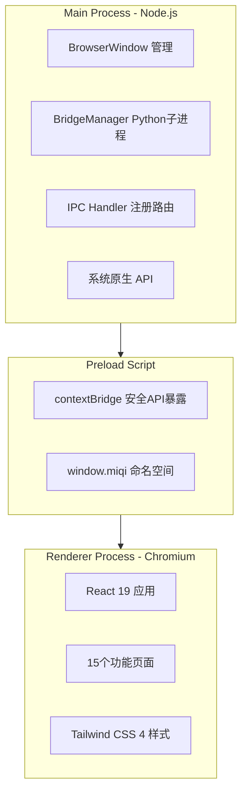

# 前端概览

MiQi Desktop 前端基于 Electron + React + TypeScript 构建，提供原生桌面级的 AI 助手交互体验。

## 技术栈

| 组件 | 技术 | 版本 |
|------|------|------|
| 桌面框架 | Electron | 35.2.1 |
| UI 框架 | React | 19.1 |
| 类型系统 | TypeScript | 5.8 |
| 构建工具 | electron-vite | 3.1 |
| CSS 框架 | Tailwind CSS 4 | 4.x |
| 组件库 | Radix UI | - |
| 图标 | Lucide React | 0.510 |
| Markdown | react-markdown + remark-gfm | - |
| 数据验证 | Zod | 3.24 |
| 打包 | electron-builder | 26.0 |
| 测试 | Vitest | 3.1 |

## 进程架构



## 安全设计

### Context Isolation

```typescript
// main/index.ts
new BrowserWindow({
  webPreferences: {
    sandbox: true,
    contextIsolation: true,
    nodeIntegration: false,
    preload: path.join(__dirname, '../preload/index.js')
  }
})
```

### Preload API

仅暴露最小必要的 API 到渲染进程：

```typescript
// preload/index.ts
contextBridge.exposeInMainWorld('miqi', {
  chat: { send, abort, onProgress },
  config: { get, set },
  sessions: { list, get, delete, archive },
  providers: { list, test, update },
  memory: { facts, lessons, deleteLesson },
  skills: { list, create, upload, delete },
  files: { diff, revert, accept },
  // ...
})
```

## 导航系统

通过 `NavId` 类型控制页面切换：

```typescript
type NavId =
  | 'chat'       // 聊天
  | 'providers'  // 提供商
  | 'channels'   // 消息通道
  | 'approvals'  // 审批
  | 'cron'       // 定时任务
  | 'memory'     // 记忆
  | 'skills'     // 技能
  | 'workspace'  // 工作区
  | 'settings'   // 设置
```

## 热重载

开发模式下，`electron-vite` 提供：

- React 组件的 HMR (Hot Module Replacement)
- Python 文件变更自动重启 Bridge 子进程
- Electron Main 进程变更自动重启应用
