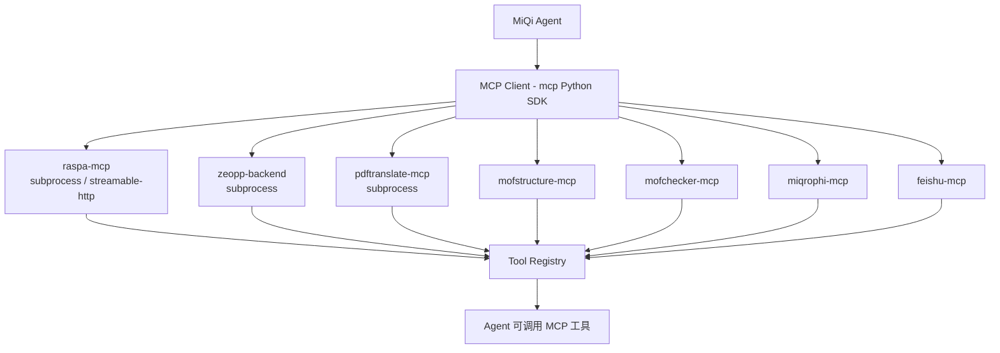

# MCP 集成

MiQi 通过 MCP (Model Context Protocol) 集成外部工具服务，由 7 个 git submodule 管理。

## MCP 服务列表

| 服务 | 目录 | 领域 | 功能 | 超时 |
|------|------|------|------|------|
| raspa-mcp | `mcps/raspa-mcp` | 材料科学 | RASPA2 分子模拟 (GCMC / MD) | 6 小时 |
| zeopp-backend | `mcps/zeopp-backend` | 材料科学 | Zeo++ 多孔材料几何分析 | 默认 |
| mofstructure-mcp | `mcps/mofstructure-mcp` | 材料科学 | MOF 晶体结构分析 | 默认 |
| mofchecker-mcp | `mcps/mofchecker-mcp` | 材料科学 | MOF 结构验证与修复 | 默认 |
| pdftranslate-mcp | `mcps/pdftranslate-mcp` | 文档处理 | 学术论文 PDF 翻译 | 1 小时 |
| miqrophi-mcp | `mcps/miqrophi-mcp` | 科学计算 | Miqrophi 计算平台接口 | 默认 |
| feishu-mcp | `mcps/feishu-mcp` | 办公协作 | 飞书消息/文档/日历 | 默认 |

## 架构



## MCP 配置

```json
{
  "tools": {
    "mcp_servers": {
      "raspa-mcp": {
        "command": "python",
        "args": ["-m", "raspa_mcp"],
        "env": { "RASPA_DIR": "/opt/raspa2" },
        "toolTimeout": 21600
      },
      "pdftranslate-mcp": {
        "command": "python",
        "args": ["-m", "pdftranslate_mcp"],
        "toolTimeout": 3600
      }
    }
  }
}
```

## MCP 工具特性

### 心跳进度报告

长时运行的工具通过心跳机制报告进度：

```
每 15 秒:
MCP Server → { "type": "progress", "current": 45, "total": 100, "message": "Running GCMC..." }
  → Bridge → renderer → Chat UI 进度条
```

### 超时控制

| 工具 | 超时 | 原因 |
|------|------|------|
| RASPA2 GCMC 模拟 | 6 小时 | 大规模分子模拟计算密集 |
| PDF 翻译 | 1 小时 | 大文件处理耗时 |
| 其他工具 | 默认 (5 分钟) | 常规计算 |

### 延迟加载

```json
{
  "lazy": true   // 仅在首次调用时启动 MCP 服务器
}
```

节省资源，避免启动时加载所有 MCP 服务。

### 环境变量继承

MCP 子进程继承 Agent 进程的环境变量，可通过 `env` 字段追加自定义变量。

## RASPA2 MCP 示例

```python
# Agent 调用 RASPA2 GCMC 模拟
from raspa_mcp import create_workspace, get_simulation_template, simulate

# 1. 创建工作区目录结构
create_workspace(
    work_dir="/tmp/sim",
    framework_name="ZIF-8",
    cif_source_path="ZIF-8.cif"
)

# 2. 生成模拟输入
template = get_simulation_template("GCMC_CO2")
simulation_input = fill_template(template, {
    "PRESSURE": "1e5",
    "TEMPERATURE": "298",
    "CYCLES": "10000"
})

# 3. 运行模拟
result = simulate(work_dir="/tmp/sim")
# → 返回吸附量、选择性、等温线
```

## 子模块管理

```bash
# 克隆时包含子模块
git clone --recurse-submodules <repo-url>

# 更新子模块
git submodule update --init --recursive

# 配置超时
./scripts/configure_mcps.sh
```
